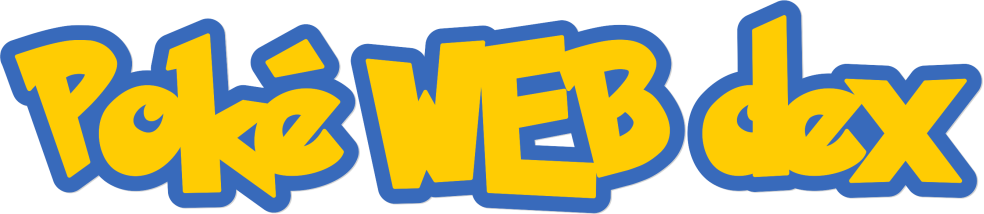

<br/><br/>
<p align=center>
    
</p>

## &nbsp;

<br/>
<p align=center>
    <a href='https://gabrieldp23.github.io/PokeWEBdex/'>gabrieldp23.github.io/PokeWEBdex</a>
    <br/><br/>
    
    &nbsp;
    
    &nbsp;
    &nbsp;
    
</p>

<br/>
<p align=center>
    
    &nbsp;&nbsp;&nbsp;&nbsp;
    
</p>
<br/>


## 💡 Motivation
This project has a personal motivation. I've been playing Pokémon games since I was a kid, and now I've been able to work on an application that combines programming and Pokémon. 

<br/>

## ✅ Legal

Pokémon images, names and information (c) 1995-2022 Nintendo/Game freak.

## ⚙️ API  

All data used in this project came from [PokéAPI](https://pokeapi.co/), a great RESTful API.


>[Access the repository](https://github.com/PokeAPI/pokeapi)

<br/>

## 🖥️ Running locally

```bash
# Clone
git clone https://github.com/gabrieldp23/PokeWEBdex.git

# Node modules
npm install

# Open project on localhost
npm start
```

